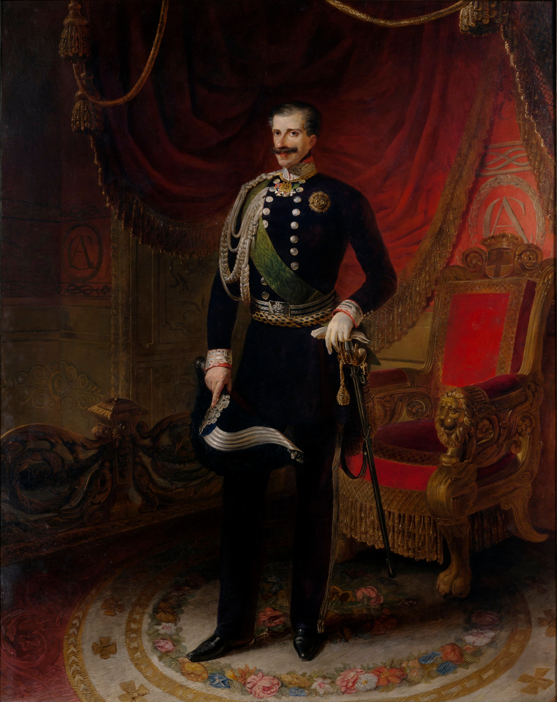

## Title
### Portrait of Carlo Alberto

## Author
### Angelo Capisani ( 1808 - 1870 )

## Date
### 1848

## Description

Numerosi sono i lavori di Capisani che lo vedono ritrarre Carlo Alberto.
L'opera in questione è datata al 1848, pochi mesi prima che Carlo Alberto abdicasse in favore del figlio Vittorio Emanuele II.

Nonostante l'educazione liberale e il non essere destinato al trono, in un primo periodo Carlo Alberto, successo a Carlo Felice in quanto non aveva eredì, avrà uno stile molto conservatore.
Nel 1949 abdicherà, dopo una sconfitta contro l'impero austriaco, in favore del figlio Vittorio Emanuele II.

## Interpretation I - Carmine Pinto, Institue of History of Risorgimento

It may often give the impression that Carlo Alberto was a monarch unpopular with the people. But the quantity and quality of works like this that were produced demonstrate otherwise.

## Interpretation II - Félix Fénéon, French Art Critic ( 1861 - 1944 )

The history of Piedmont is deeply connected to that of France.
This is evident in portraits like this, which draw heavily from the French style of the time.

