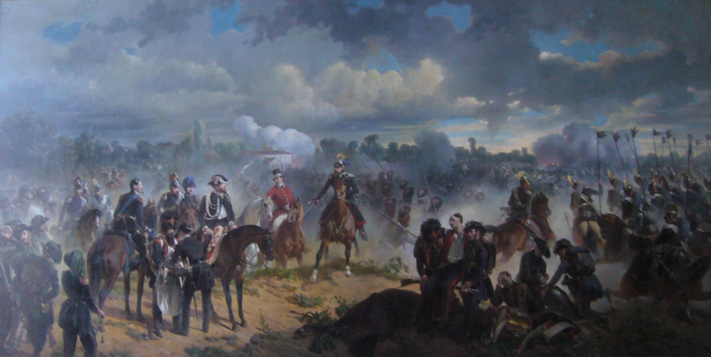

## Title
### Battaglia di Goito (Battle of Goito)

## Author
### Felice Cerruti Bauduc (1818-1896)

## Date
### 1856

## Description

Upon returning from the First Italian War of Independence, Cerruti decided to pursue an artistic career where he would reenact scenes of battle.

The painting depicts the attack by the Austrian army on the Piedmontese army stationed in defense of the bridge over the Mincio, near Goito.
The battle ended in favor of the Piedmontese army.

## Interpretation I -- Mattia Palazzi, Mayor of Mantova

What might seem like just another battle painting to some, in my eyes and I believe in the eyes of Mantovan citizens, represents an important piece of its history.

## Interpretation II -- Pietro Giovanni Delprato, Veterinarian ( 1815 - 1880 )

What has always struck me about Cerruti is the level of detail he was able to capture in depicting horses.
As a veterinarian colleague, the knowledge he acquired through years of studying animals is masterfully incorporated into his works.

## Interpretation III -- User Suggestion

This painting hides a small detail that if you focus on the more obvious ones, risks going unnoticed: a little to the left, wearing a top hat, we can see Vittorio Emanuele II.