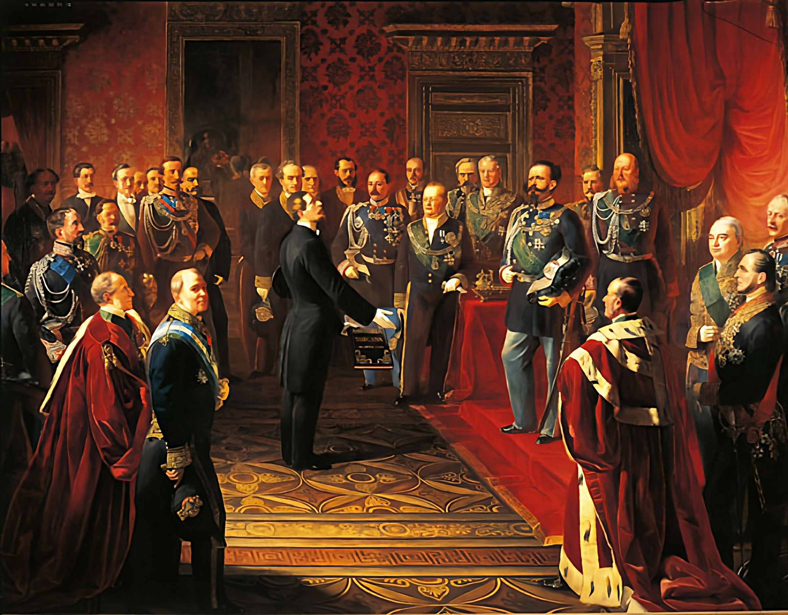

## Title
### Bettino Ricasoli Presenta il Plebiscito di Annessione della Toscana all'Italia di Vittorio Emanuele II (Bettino Ricasoli Presents the Plebiscite of Annexation of Tuscany to Italy to Vittorio Emanuele II)

## Author
### Silvio Capisanti (1801-1852)

## Date
### XIX Century

## Description

Following the Armistice of Villafranca, which will bring an end to the Second War of Independence, the provisional government of Tuscany called for a plebiscite to ratify its annexation to the Kingdom of Sardinia.

The vast majority of Tuscans voted in favor of annexation, with little surprise given that over the years the people had repeatedly expressed support for the cause of the House of Savoy.

In the painting we see depicted Bettino Ricasoli, at the time the Prime Minister of the Grand Duchy of Tuscany, reporting the results of the plebiscite to Vittorio Emanuele II. Following the great success and the personal recognition of his merits, he was first appointed provisional governor of Tuscany and then Minister of the Interior in what will be the Kingdom of Italy.

## Interpretation I

## Interpretation II

## Interpretation III