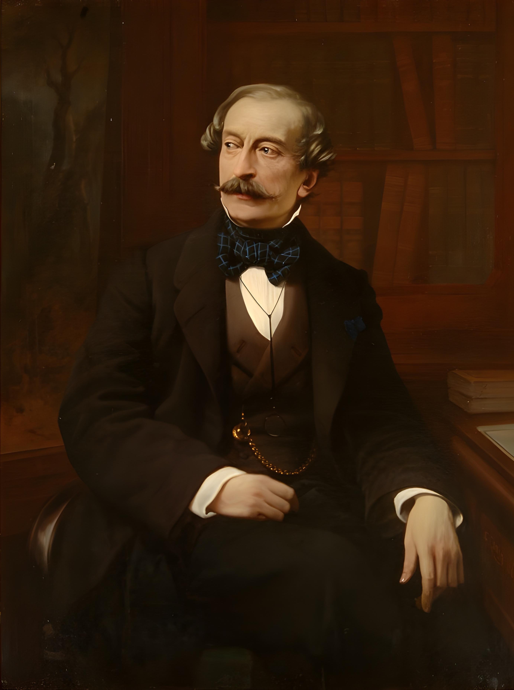

## Title
### Portrait of Massimo d'Azeglio

## Author
## Francesco Gonin ( 1808 - 1889 )

## Date
### 1860

## Description

Massimo d'Azeglio is known in history for both his artistic qualities as a painter and writer, as well as his political ones, first as a member of parliament and then as a senator of the Kingdom of Sardinia.
At the time of the painting, he held the position of Governor of the Province of Milan.

## Interpretation I -- Enrica Pagella, Director of the Royal Museums of Turin

During his life Gonin depicted many portraits of illustrious figures, as he was known for his style.
Another technique he was famous for is the fresco: in fact, he painted the frescoes in the ballroom of the Royal Palace of Turin.

## Interpretation II -- Vittorio Sgarbi, Art Critic

Many portraits show d'Azeglio wearing a blue bow tie, including this one. I like to think that this is a reference to the republican spirit that characterized him.