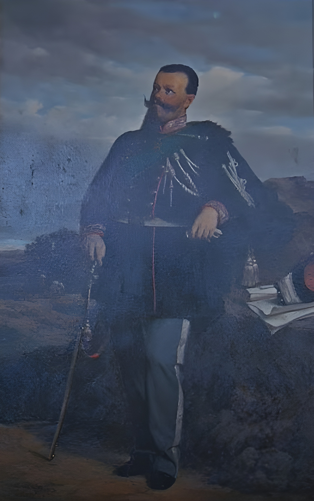

## Title
## Portrait of Vittorio Emanuele II

## Author
## Rodolfo Morgari ( 1827 - 1909 )

## Date
### 1860 ca.

## Description

Rodolfo Morgari was a versatile painter, able to work in multiple styles and on multiple occasions he portrayed Vittorio Emanuele II. 
He also took part in the First War of Independence.

Having been noticed not only for his artistic talents but also for his skills as a restorer, he was appointed as the painter and restorer of the Royal Palaces, both public and private.

## Interpretation I --  Indro Montanelli (corriere della sera)

In the portrait you notice the uniform of the condottiero worn with pride by Vittorio Emanuele, 
the right sword in the right hand and the face thoughtful about the upcoming battles 

## Interpretation II -- Vittorio Sgarbi 

The King is in a solemn pose and wears the general’s uniform officially introduced in May.
The painting was finished before Pizzardi’s resignation from the municipal office, as evidenced, among other things, by the Felsinei coat of arms of the frame. 
We also know that the painter painted the portrait «using the face of a photograph»: a technique that from the end of the fifth decade of the nineteenth century had become an important means for painters to study the "true"

## Interpretation III

The author therefore makes use of the advantage of the photographic medium to reproduce a model impossible to pose, managing to grasp the psychological nuance of the subject thanks to the wise use of light, regulated on a predominantly plumbea color.