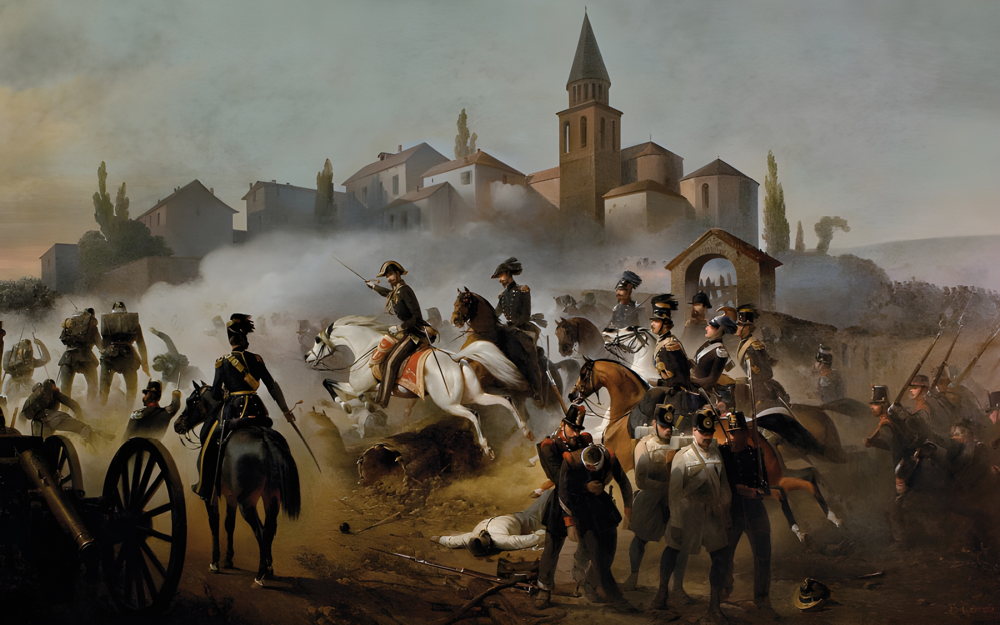

## Title
### Sommacampagna

## Author
### Felice Cerruti Bauduc (1818-1896)

## Date
### 1855

## Description

The work, like others by Cerruti, is clearly a representation of the Piedmontese army during the First Italian War of Independence, intent on facing the Austrian troops led by General Josef Radetzky.

Although the place and historical period are well known, the reported event remains a subject of debate.
A commonly accepted version, and the one reported where the painting is displayed, that is the Museum of the Risorgimento in Turin, would be that the painting represents the Battle of Pastrengo of April 1848, but many scholars think it could also be the Battle of Custoza that occurred a few months later, in July 1848.

## Interpretation I

## Interpretation II

## Interpretation III