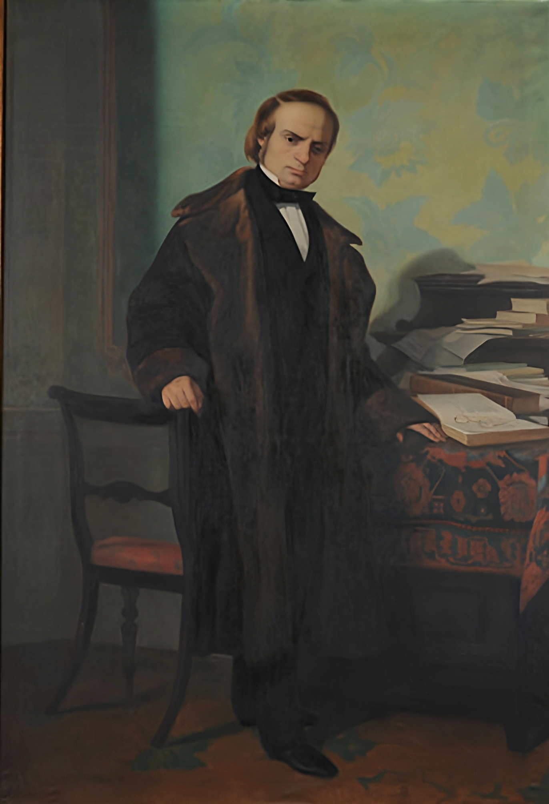

## Title
### Post Mortem Portrait of Vincenzo Gioberti

## Author
### Antonio Puccinelli (1822-1897)

## Date
### 1861

## Description

In September 1859, Bettino Ricasoli, then Minister of the Interior of the provisional government of Tuscany, announced a competition for the creation of works of art on the theme of the Risorgimento.
Among those created is this painting by Antonio Puccinelli, who at the time was a professor at the Academy of Fine Arts in Florence.

The subject portrayed is Vincenzo Gioberti, an Italian chaplain and politician, who became known for his proximity to the Risorgimento movements.
Initially in favor of a united Italy led by the church, later he will change his mind and support the Savoyard cause, and also become President of the Council of Ministers of the Kingdom of Sardinia.

## Interpretation I -- Classic

This type of portrait was very expensive so accessible only to nobles or wealthy bourgeois. 
The subject is standing with one hand on the chair, the right foot is slightly in the hand and as well as the body giving the work a certain dynamism.
The background appears darker on the left side while on the right it lightens slightly except for the shadow of Gioberti. 

## Interpretation II -- Barbero

According to the historian and professor alessandro barbero the book leaning on the table could be the famous "Del rinnovamento civile d'italia". 
It works where the thought of Gioberti shines through according to which the being of God represents the rational and the being of man the real. 
The subject appears thoughtful and may even seem a little angry.

## Interpretation III -- Mazzocca

Professor Fernando Mazzocca dwells on the idea of power that Gioberti probably tried to give through this portrait.
 His clothes are very elegant and the desk full of books and essays refers to the knowledge and political importance of the character.
 Even the face, thoughtful and concentrated, highlights the importance of the subject’s decisions, referring once again to the power possessed by him